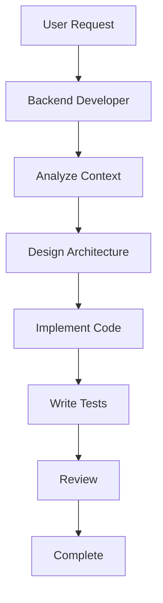

# Рекомендации по улучшению наборов Claude Code Subagents

## Общие рекомендации для всех репозиториев

### 1. Гибридный подход к длине промптов

**Проблема:** 
Длинные промпты (2000-4000 токенов) обеспечивают высокое качество, но увеличивают потребление токенов и время обработки. Краткие промпты (500-800 токенов) экономят токены, но могут требовать больше итераций.

**Решение:**
Создать два уровня каждого агента:

```yaml
# Light версия для простых задач
---
name: backend-developer-light
description: Quick backend tasks - simple endpoints, bug fixes, minor changes
prompt_length: 600-800 tokens
use_cases:
  - Simple CRUD endpoints
  - Bug fixes
  - Minor refactoring
  - Quick API additions
tools: Read, Write, Edit, Bash, Grep
model: claude-haiku-3.5  # Быстрая модель для простых задач
---

# Pro версия для сложных задач
---
name: backend-developer-pro
description: Complex backend architecture - system design, microservices, optimization
prompt_length: 2000-3000 tokens
use_cases:
  - System architecture design
  - Microservices implementation
  - Performance optimization
  - Complex integrations
tools: Read, Write, Edit, Bash, Grep, Glob, WebSearch, mcp__context7__*
model: claude-sonnet-4  # Мощная модель для сложных задач
---
```

**Преимущества:**
- Экономия токенов для простых задач (до 60%)
- Высокое качество для сложных задач
- Автоматический выбор версии на основе анализа сложности

**Реализация:**
```python
def select_agent_version(task_complexity, task_type):
    if task_complexity < 3 and task_type in ['bug_fix', 'simple_feature']:
        return 'backend-developer-light'
    else:
        return 'backend-developer-pro'
```

---

### 2. Адаптивные промпты с динамическими секциями

**Идея:**
Промпты, которые адаптируются под контекст задачи и проекта.

**Реализация:**
```yaml
---
name: backend-developer-adaptive
description: Backend developer with adaptive prompt sections
sections:
  - name: core_instructions
    always_include: true
    tokens: 300
    
  - name: language_specific
    include_if: "project.language in ['python', 'go', 'typescript']"
    tokens: 400
    
  - name: framework_specific
    include_if: "project.framework in ['fastapi', 'express', 'gin']"
    tokens: 300
    
  - name: architecture_patterns
    include_if: "task.complexity > 5"
    tokens: 500
    
  - name: integration_patterns
    include_if: "project.has_integrations"
    tokens: 400
---
```

**Преимущества:**
- Оптимизация токенов за счет включения только релевантных секций
- Адаптация под конкретный проект
- Сохранение качества за счет включения всех необходимых секций

---

### 3. Система метрик производительности

**Рекомендация:**
Добавить в каждый агент секцию с метриками производительности.

**Формат:**
```yaml
---
name: backend-developer
description: ...
performance_metrics:
  baseline:
    avg_tokens_per_task: 50000
    avg_time_per_task: 5m
    success_rate: 95%
    avg_iterations: 2.3
    
  by_complexity:
    simple:
      avg_tokens: 15000
      avg_time: 2m
      success_rate: 98%
    medium:
      avg_tokens: 50000
      avg_time: 5m
      success_rate: 95%
    complex:
      avg_tokens: 150000
      avg_time: 15m
      success_rate: 90%
      
  optimization_targets:
    token_reduction: 20%
    time_reduction: 15%
    success_rate_improvement: 2%
---
```

**Использование:**
- Отслеживание эффективности агентов
- Выявление проблемных областей
- Оптимизация на основе данных
- Сравнение версий агентов

---

### 4. Универсальная интеграция с MCP серверами

**Рекомендация:**
Все агенты должны использовать стандартный набор MCP серверов:

```yaml
standard_mcp_servers:
  - context7:  # Актуальная документация библиотек
    purpose: "Access to up-to-date library documentation"
    usage: "When working with frameworks, libraries, APIs"
    
  - sequential-thinking:  # Улучшенное мышление
    purpose: "Complex reasoning and analysis"
    usage: "For architecture decisions, complex problem solving"
    
  - filesystem:  # Работа с файлами
    purpose: "File operations and project structure"
    usage: "Always available for file operations"
    
  - web-search:  # Поиск информации
    purpose: "Finding latest information and solutions"
    usage: "When documentation is outdated or missing"
```

**Пример интеграции:**
```yaml
---
name: backend-developer
tools: 
  - Read
  - Write
  - Edit
  - Bash
  - mcp__context7__resolve-library-id
  - mcp__context7__get-library-docs
  - mcp__sequential-thinking__sequentialthinking
  - mcp__filesystem__*
---
```

---

### 5. Улучшенная система оркестрации

**Идея:**
Создать систему приоритетов, зависимостей и параллелизации для агентов.

**Формат:**
```yaml
---
name: backend-architect
agent_dependencies:
  requires:
    - context-manager: "Get project context"
    - requirements-analyzer: "Analyze requirements"
    
  provides_to:
    - backend-developer: "Architecture design"
    - security-auditor: "Security review"
    - performance-engineer: "Performance analysis"
    
  parallel_with:
    - frontend-architect: "Can work in parallel"
    - database-architect: "Can work in parallel"
    
  priority: high
  
  execution_order: 1  # Execute first in workflow
---
```

**Оркестратор:**
```python
class AgentOrchestrator:
    def plan_workflow(self, task, available_agents):
        # Построить граф зависимостей
        dependency_graph = self.build_dependency_graph(available_agents)
        
        # Определить параллельные задачи
        parallel_groups = self.find_parallel_groups(dependency_graph)
        
        # Оптимизировать порядок выполнения
        execution_order = self.optimize_execution_order(parallel_groups)
        
        return execution_order
```

**Преимущества:**
- Автоматическая оптимизация workflow
- Параллелизация независимых задач
- Управление зависимостями
- Минимизация времени выполнения

---

### 6. Кэширование контекста проекта

**Проблема:**
Каждый агент запрашивает контекст проекта заново, что увеличивает потребление токенов.

**Решение:**
Создать систему кэширования контекста:

```python
class ContextCache:
    def __init__(self):
        self.cache = {}
        self.ttl = 3600  # 1 час
        
    def get_project_context(self, project_path):
        cache_key = self._generate_key(project_path)
        
        if cache_key in self.cache:
            cached_data = self.cache[cache_key]
            if time.time() - cached_data['timestamp'] < self.ttl:
                return cached_data['context']
        
        # Загрузить и кэшировать
        context = self._load_context(project_path)
        self.cache[cache_key] = {
            'context': context,
            'timestamp': time.time()
        }
        return context
```

**Интеграция в агентов:**
```yaml
---
name: backend-developer
context_loading:
  use_cache: true
  cache_ttl: 3600
  cache_invalidation:
    - on_file_change: false  # Не инвалидировать на каждое изменение
    - on_structure_change: true  # Инвалидировать при изменении структуры
---
```

**Преимущества:**
- Экономия токенов (до 30-40% для повторных запросов)
- Ускорение работы агентов
- Консистентность контекста между агентами

---

### 7. Версионирование и A/B тестирование

**Рекомендация:**
Добавить версионирование агентов для отслеживания улучшений:

```yaml
---
name: backend-developer
version: 2.1.0
changelog:
  - version: 2.1.0
    date: 2024-01-15
    changes:
      - "Added MCP context7 integration"
      - "Optimized prompt length by 15%"
      - "Improved error handling"
      
  - version: 2.0.0
    date: 2024-01-01
    changes:
      - "Major refactoring of prompt structure"
      - "Added workflow protocols"
      
compatibility:
  min_claude_version: "3.5"
  recommended_claude_version: "4.0"
  
ab_testing:
  enabled: true
  variants:
    - name: "v2.1.0-standard"
      weight: 70
    - name: "v2.1.0-optimized"
      weight: 30
---
```

**Преимущества:**
- Отслеживание изменений
- Обратная совместимость
- A/B тестирование улучшений
- Откат к предыдущим версиям при проблемах

---

### 8. Автоматическое тестирование агентов

**Идея:**
Создать тестовый набор для каждого агента.

**Структура тестов:**
```yaml
---
name: backend-developer-tests
test_suite:
  unit_tests:
    - name: "Simple CRUD endpoint creation"
      input: "Create GET /users endpoint"
      expected_output:
        - "Endpoint created"
        - "Tests written"
        - "Documentation added"
      max_tokens: 20000
      max_time: 3m
      
    - name: "Error handling implementation"
      input: "Add error handling to existing endpoint"
      expected_output:
        - "Error handling added"
        - "Tests updated"
      max_tokens: 15000
      max_time: 2m
      
  integration_tests:
    - name: "Multi-agent workflow"
      agents: [backend-architect, backend-developer, test-automator]
      input: "Design and implement user authentication system"
      expected_output:
        - "Architecture designed"
        - "Code implemented"
        - "Tests written"
      max_tokens: 100000
      max_time: 15m
      
  performance_tests:
    - name: "Token efficiency"
      target: "Reduce tokens by 20%"
      baseline: 50000
      target_value: 40000
      
    - name: "Time efficiency"
      target: "Reduce time by 15%"
      baseline: 5m
      target_value: 4m15s
---
```

**Автоматизация:**
```python
class AgentTester:
    def run_test_suite(self, agent_name):
        tests = self.load_tests(agent_name)
        results = []
        
        for test in tests:
            result = self.execute_test(test)
            results.append({
                'test': test.name,
                'passed': result.success,
                'tokens_used': result.tokens,
                'time_taken': result.time,
                'output_quality': result.quality_score
            })
        
        return self.generate_report(results)
```

---

### 9. Улучшенная документация с примерами

**Рекомендация:**
Каждый агент должен иметь:

1. **README с примерами:**
```markdown
# Backend Developer Agent

## Quick Start
\`\`\`bash
# Simple task
"Use backend-developer to create GET /users endpoint"

# Complex task  
"Use backend-developer-pro to design microservices architecture"
\`\`\`

## Examples

### Example 1: Simple API Endpoint
**Input:** Create GET /users endpoint with pagination
**Tokens Used:** 15,000
**Time:** 2m 30s
**Output Quality:** 9/10
**Files Created:** 3
**Tests Written:** 5

### Example 2: Complex System Design
**Input:** Design user authentication microservice
**Tokens Used:** 120,000
**Time:** 12m
**Output Quality:** 9.5/10
**Files Created:** 15
**Tests Written:** 45
```

2. **Визуализации workflow:**


3. **Troubleshooting guide:**
```markdown
## Common Issues

### Issue: Agent not understanding requirements
**Solution:** Provide more context about project structure
**Example:** "In this FastAPI project, create..."

### Issue: Too many iterations
**Solution:** Use backend-developer-pro for complex tasks
**Alternative:** Break task into smaller subtasks
```

---

### 10. Сообщество и обратная связь

**Идея:**
Создать систему для сбора метрик и обратной связи:

```yaml
---
name: backend-developer
feedback_system:
  metrics_collection:
    enabled: true
    collect:
      - tokens_used
      - time_taken
      - success_rate
      - user_satisfaction
      - error_types
      
  feedback_channels:
    - github_issues: "Report problems"
    - github_discussions: "Suggest improvements"
    - metrics_dashboard: "View usage statistics"
    
  rating_system:
    enabled: true
    prompt_after_task: true
    collect_ratings:
      - quality: 1-10
      - speed: 1-10
      - accuracy: 1-10
      - helpfulness: 1-10
---
```

**Dashboard метрик:**
- Популярность агентов
- Средние метрики производительности
- Тренды использования
- Проблемные области
- Предложения по улучшению

---

## Специфические рекомендации по репозиториям

### Для VoltAgent/awesome-claude-code-subagents:

1. **Добавить метрики токенов:**
   - Создать секцию с метриками для каждого агента
   - Добавить примеры с реальными метриками
   - Создать dashboard для отслеживания

2. **Оптимизировать длинные промпты:**
   - Создать light версии для простых задач
   - Использовать адаптивные секции
   - Оптимизировать структуру

3. **Расширить интеграцию MCP:**
   - Добавить больше MCP серверов
   - Создать стандартный набор для всех агентов
   - Документировать использование

### Для 0xfurai/claude-code-subagents:

1. **Добавить протоколы коммуникации:**
   - Создать стандартные протоколы между агентами
   - Добавить примеры workflow
   - Интегрировать оркестрацию

2. **Расширить детализацию:**
   - Добавить больше деталей для сложных задач
   - Создать pro версии агентов
   - Добавить примеры использования

3. **Интегрировать MCP:**
   - Добавить context7 для документации
   - Интегрировать sequential-thinking
   - Использовать filesystem MCP

### Для lst97/claude-code-sub-agents:

1. **Оптимизировать длинные промпты:**
   - Создать light версии для простых задач
   - Использовать адаптивные секции
   - Оптимизировать структуру

2. **Расширить покрытие:**
   - Добавить больше агентов для других доменов
   - Создать специализированные агенты
   - Интегрировать с другими репозиториями

3. **Добавить версионирование:**
   - Версионировать агентов
   - Отслеживать изменения
   - A/B тестирование

### Для zhsama/claude-sub-agent:

1. **Добавить метрики:**
   - Добавить примеры с реальными метриками
   - Создать dashboard для отслеживания
   - Документировать производительность

2. **Сделать workflow более гибким:**
   - Добавить возможность пропускать фазы
   - Создать адаптивные workflow
   - Добавить параллелизацию

3. **Расширить набор агентов:**
   - Добавить больше специализированных агентов
   - Интегрировать с другими репозиториями
   - Создать агентов для новых доменов

---

## Приоритеты внедрения

### Высокий приоритет (внедрить немедленно):
1. ✅ Система метрик производительности
2. ✅ Интеграция с MCP серверами (context7, sequential-thinking)
3. ✅ Улучшенная документация с примерами
4. ✅ Версионирование агентов

### Средний приоритет (внедрить в ближайшее время):
1. ✅ Гибридный подход (light/pro версии)
2. ✅ Кэширование контекста
3. ✅ Автоматическое тестирование
4. ✅ Система обратной связи

### Низкий приоритет (долгосрочные улучшения):
1. ✅ Адаптивные промпты
2. ✅ Улучшенная оркестрация
3. ✅ A/B тестирование
4. ✅ Dashboard метрик

---

## Заключение

Эти рекомендации помогут улучшить все наборы субагентов, сделав их более эффективными, производительными и полезными для увеличения производительности Claude Code. Ключевой момент - баланс между качеством и эффективностью, адаптация под конкретные задачи и постоянное улучшение на основе метрик и обратной связи.
