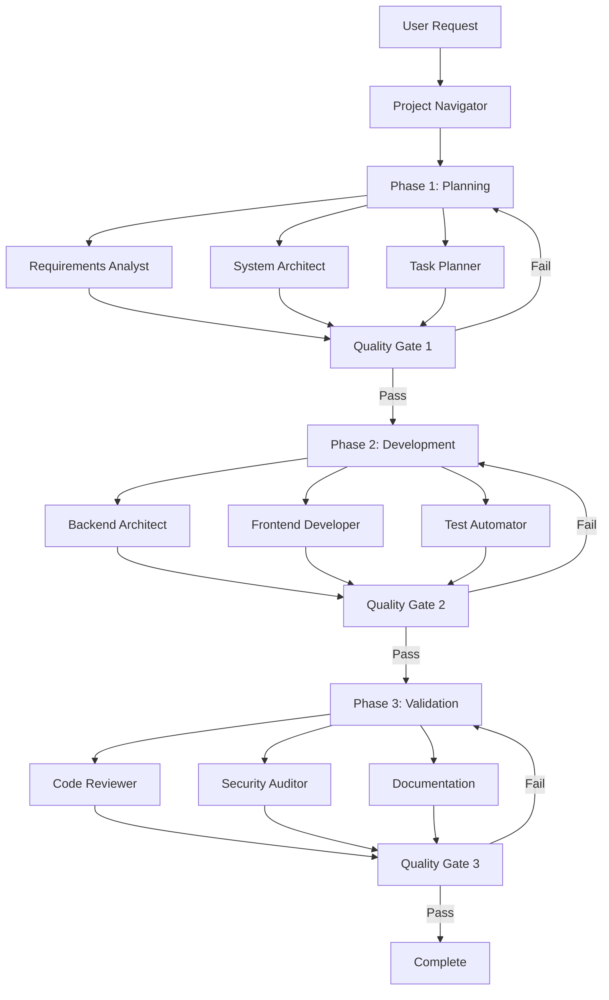

# Claude Code Navigator

A comprehensive, production-ready collection of intelligent subagents for Claude Code, combining the best practices from leading subagent repositories. This project unifies advanced orchestration, detailed agent specifications, structured workflows, and quality gates into a cohesive system optimized for full-stack development.

## 🎯 Philosophy

Claude Code Navigator combines the best of three approaches:

- **Deep Agent Specifications**: Detailed development philosophies, decision-making frameworks, and MCP integrations
- **Structured Workflows**: Three-phase development model (Planning → Development → Validation) with quality gates
- **Intelligent Orchestration**: Strategic agent selection and coordination based on project analysis

## 🏗️ Architecture

### Three-Phase Development Model

All projects follow a structured approach with quality gates:

1. **Planning & Analysis** (20-25%): Requirements analysis, architecture design, task breakdown
2. **Development & Implementation** (60-65%): Code implementation with quality standards
3. **Validation & Deployment** (15-20%): Code review, testing, security audit, documentation

### Quality Gates

- **Gate 1**: Planning validation (95% threshold)
- **Gate 2**: Development validation (85% threshold)
- **Gate 3**: Release readiness validation (95% threshold)

## 📁 Structure

```
claude-code-navigator/
├── agents/
│   ├── orchestration/
│   │   └── project-navigator.md      # Master orchestrator
│   ├── planning/
│   │   ├── requirements-analyst.md  # Requirements analysis
│   │   ├── system-architect.md      # Architecture design
│   │   └── task-planner.md           # Task breakdown
│   ├── development/
│   │   ├── backend-architect.md      # Backend development
│   │   ├── frontend-developer.md     # Frontend development
│   │   ├── fullstack-developer.md    # Full-stack development
│   │   ├── python-pro.md            # Python specialist
│   │   ├── typescript-pro.md        # TypeScript specialist
│   │   └── golang-pro.md            # Go specialist
│   ├── quality/
│   │   ├── code-reviewer.md         # Code review
│   │   ├── test-automator.md       # Test automation
│   │   └── security-auditor.md     # Security audit
│   └── infrastructure/
│       ├── devops-engineer.md      # DevOps
│       └── performance-engineer.md  # Performance optimization
├── commands/
│   └── navigate.md                  # Slash command
└── docs/
    └── README.md                    # This file
```

## 🚀 Quick Start

### Using the Project Navigator

The `project-navigator` agent is the main entry point for complex projects:

1. **Invoke the navigator** with your project requirements
2. **Analysis phase**: Navigator analyzes your project and creates a development plan
3. **Execution**: Follow the three-phase workflow with quality gates
4. **Validation**: Ensure all quality gates pass before proceeding

### Example Workflow

```markdown
User: "Add user authentication to my React app with Node.js backend"

Project Navigator:
1. Analyzes project structure and requirements
2. Creates development plan with three phases
3. Selects appropriate agents for each phase
4. Coordinates workflow with quality gates

Phase 1: Planning
- requirements-analyst: Analyzes auth requirements
- system-architect: Designs auth architecture
- task-planner: Breaks into actionable tasks
- Quality Gate 1: Validates planning completeness

Phase 2: Development
- backend-architect: Implements auth backend
- frontend-developer: Implements auth UI
- test-automator: Creates test suite
- Quality Gate 2: Validates code quality and tests

Phase 3: Validation
- code-reviewer: Reviews code
- security-auditor: Security review
- api-documenter: Documents API
- Quality Gate 3: Final validation
```

## 🔧 Agent Categories

### Orchestration Agents

- **project-navigator**: Master orchestrator for intelligent workflow coordination

### Planning Agents

- **requirements-analyst**: Comprehensive requirements analysis and documentation
- **system-architect**: System architecture design with trade-off analysis
- **task-planner**: Task breakdown with dependency mapping and risk assessment

### Development Agents

- **backend-architect**: Backend system design and implementation
- **frontend-developer**: Frontend development with modern frameworks
- **fullstack-developer**: Full-stack feature development
- **python-pro**: Python development specialist
- **typescript-pro**: TypeScript development specialist
- **golang-pro**: Go development specialist

### Quality Agents

- **code-reviewer**: Comprehensive code review
- **test-automator**: Test automation and coverage
- **security-auditor**: Security vulnerability assessment

### Infrastructure Agents

- **devops-engineer**: CI/CD and deployment
- **performance-engineer**: Performance optimization and monitoring

## 🎓 Key Features

### 1. Intelligent Planning

- Requirements analysis with stakeholder mapping
- Architecture design with trade-off analysis
- Task breakdown with dependency management
- Risk identification and mitigation

### 2. Quality-First Development

- Quality gates between phases
- Comprehensive testing strategies
- Security-first approach
- Code review integration

### 3. MCP Integration

All agents leverage MCP tools for enhanced capabilities:

- **context7**: Research patterns, documentation, best practices
- **sequential-thinking**: Complex analysis and decision-making

### 4. Structured Output

Every agent provides structured, actionable output:

- Clear documentation
- Code examples
- Testing strategies
- Quality checklists

## 📋 Best Practices

### For Simple Tasks

Use specific agents directly:
- `backend-architect` for backend changes
- `frontend-developer` for frontend changes
- `code-reviewer` for code review

### For Complex Projects

Use `project-navigator`:
1. Navigator analyzes project
2. Creates three-phase plan
3. Coordinates agents through phases
4. Ensures quality gates pass

### For Full-Stack Features

Use `project-navigator` with full-stack workflow:
- Planning phase: Requirements and architecture
- Development phase: Backend + Frontend coordination
- Validation phase: Integration testing and review

## 🔍 Quality Standards

All agents adhere to:

- **Test Coverage**: >80% for business logic, >90% for critical paths
- **Code Quality**: Linting, type checking, security scanning
- **Documentation**: Clear, comprehensive documentation
- **Performance**: Meets specified performance requirements
- **Security**: OWASP Top 10 compliance

## 🤝 Integration

### With Existing Projects

1. Add agents to your Claude Code configuration
2. Use `project-navigator` for complex tasks
3. Follow the three-phase workflow
4. Ensure quality gates pass

### With Other Tools

- **CI/CD**: Quality gates integrate with CI/CD pipelines
- **Documentation**: Agents generate comprehensive documentation
- **Testing**: Test strategies integrate with existing test frameworks

## 📚 Documentation

Each agent includes:

- Core development philosophy
- Decision-making framework
- Output structure requirements
- Quality checklists
- Integration guidelines

## 🎯 Use Cases

### 1. New Feature Development

- Planning: Requirements analysis → Architecture design → Task breakdown
- Development: Backend + Frontend implementation
- Validation: Code review → Testing → Security audit

### 2. System Refactoring

- Planning: Analyze current system → Design new architecture → Plan migration
- Development: Incremental refactoring with tests
- Validation: Comprehensive testing → Performance validation

### 3. Bug Fixes

- Quick analysis → Fix implementation → Test → Review

### 4. Performance Optimization

- Analysis → Optimization → Testing → Validation

## 🔄 Workflow Example



## 🛠️ Configuration

### Agent Selection

Agents are selected based on:

- Project technology stack
- Task complexity
- Phase requirements
- Quality standards

### Quality Gates

Configure thresholds:

- Planning: 95% completeness
- Development: 85% quality, 80% test coverage
- Validation: 95% readiness

## 📊 Metrics

Track project success:

- **Quality**: Code quality scores, test coverage
- **Performance**: Response times, throughput
- **Security**: Vulnerability counts, security scores
- **Timeline**: Phase completion, overall timeline

## 🤔 FAQ

### When to use project-navigator?

Use for complex, multi-phase projects requiring coordination between multiple agents.

### When to use agents directly?

Use for simple, single-domain tasks (e.g., backend-only changes).

### How are quality gates enforced?

Quality gates are validated automatically between phases. Projects cannot proceed without passing gates.

### Can I customize workflows?

Yes, agents can be used independently or in custom workflows. The three-phase model is recommended but not required.

## 📝 License

This project combines best practices from multiple open-source subagent repositories. Please refer to individual agent files for specific attributions.

## 🙏 Acknowledgments

This project combines the best practices from:

- Advanced agent specifications with deep development philosophies
- Structured workflow systems with quality gates
- Intelligent orchestration with strategic agent selection

---

**Built for intelligent, quality-first full-stack development with Claude Code.**
